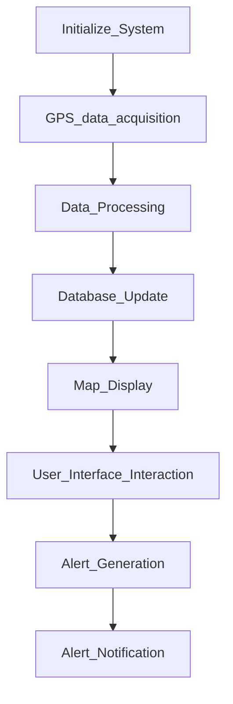

# Problem Id - CBP18
## Real time vehicle tracking system through gps 

## Goal Definition :
the main objective of this project is to create a platform which will track vehicle in real time and provide enhance traavelling experience. it will also be integrated with smart traffic system to for better mobility.

# Initialize System:
Start the tracking system and initialize the variables.
# GPS data acquisition: 
Accquire real time GPS data from the vehicle.

Start: Begin the flowchart.

Initialize System: Start the tracking system and

initialize variables.
GPS Data acquisition : Acquire real-time GPS data from
the vehicle.
Data Processing: Process the GPS data to extract
relavent information (location, speed, direction).
Dtabase Update: Update the database with the latest
vehicle location and information.
Map Display: Display the vehicle's current location on a 
Map intertface.
User Interface Interaction: Allow user interaction with
the system (eg.Zooming in/out,planning).
Alert Generation : Generate alerts for any predefined
events.
Alert Notification:Notify users or adminstrators of any 
alerts via SMS,email,or adminstrator of any 
aleert via SMS,email,or app notification.
End; End the flowchart.

